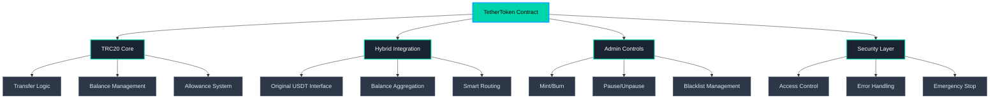

# TetherToken (USDT) - Community Edition
### Professional-Grade TRC20 Implementation with Hybrid Integration

---

## 🚀 Overview

**TetherToken** represents an innovative approach to stablecoin implementation, combining the familiar TRC20 token standard with hybrid integration capabilities to the original Tether USDT contract. This implementation provides enhanced flexibility for DeFi applications while maintaining full backward compatibility.

### Key Features

- **🔗 Hybrid Integration**: Seamlessly works with original USDT contract
- **⚡ TRC20 Compatible**: Full compliance with TRC20 standard
- **🛡️ Security First**: Built-in pause, blacklist, and emergency controls
- **🌐 Open Source**: MIT licensed with transparent implementation
- **🏛️ Community Driven**: Designed for community governance and development

---

## 📋 Contract Information

| Property | Value |
|----------|-------|
| **Contract Address** | `TVvHYiz294Q1ZeTjRTWTczJJjVz9yS8FEP` |
| **Token Name** | `Tether USD` |
| **Token Symbol** | `USDT` |
| **Decimals** | `6` |
| **Standard** | `TRC20` |
| **Network** | `TRON` |
| **Total Supply** | `Dynamic (Mintable)` |

---

## 🏗️ Architecture

### Core Components

### Hybrid Integration System

The innovative hybrid system allows users to:
- View combined balances (internal + original USDT)
- Transfer using optimal routing algorithms
- Maintain compatibility with existing infrastructure
- Access enhanced DeFi functionality

---

## 📚 API Reference

### Standard TRC20 Functions

| Function | Description | Access |
|----------|-------------|---------|
| `name()` | Returns token name | Public |
| `symbol()` | Returns token symbol | Public |
| `decimals()` | Returns decimal places | Public |
| `totalSupply()` | Returns total token supply | Public |
| `balanceOf(address)` | Returns balance (hybrid when enabled) | Public |
| `transfer(address, uint256)` | Transfer tokens | Public |
| `approve(address, uint256)` | Approve spending | Public |
| `transferFrom(address, address, uint256)` | Transfer from approved | Public |
| `allowance(address, address)` | Check allowance | Public |

### Hybrid Integration Functions

| Function | Description | Access |
|----------|-------------|---------|
| `enableIntegration()` | Enable hybrid mode | Owner |
| `disableIntegration()` | Disable hybrid mode | Owner |
| `getOriginalUSDTBalance(address)` | Get original USDT balance | Public |
| `internalBalanceOf(address)` | Get internal balance only | Public |

### Administrative Functions

| Function | Description | Access |
|----------|-------------|---------|
| `pause()` | Pause all operations | Owner |
| `unpause()` | Resume operations | Owner |
| `addBlackList(address)` | Add to blacklist | Owner |
| `removeBlackList(address)` | Remove from blacklist | Owner |
| `issue(uint256)` | Mint new tokens | Owner |
| `redeem(uint256)` | Burn tokens | Owner |

---

## 🛡️ Security Features

### Access Control
- **Owner-based governance** with multi-signature recommended
- **Modifier-based protection** for sensitive functions
- **Role-based permissions** for different operations

### Emergency Controls
- **Pause mechanism** for immediate operation halt
- **Blacklist system** for compliance and security
- **Fund destruction** for emergency situations

### External Contract Safety
- **Interface validation** with original USDT contract
- **Comprehensive error handling** for external calls
- **Fallback mechanisms** for contract unavailability

---

## 🎯 Use Cases

### DeFi Applications
- **Liquidity Pools**: Base asset for AMMs with enhanced flexibility
- **Lending Protocols**: Collateralize combined USDT holdings
- **Yield Farming**: Participate while maintaining original USDT access

### Cross-Chain Operations
- **Bridge Compatibility**: Intermediary for cross-chain transfers
- **Multi-Chain DeFi**: Standardized interface across ecosystems

### Institutional Applications
- **Treasury Management**: Enhanced organizational asset management
- **Compliance Integration**: Built-in regulatory compliance tools

### Developer Tools
- **Testing Environment**: Simulate USDT behavior in development
- **Protocol Integration**: Enhanced USDT functionality for new protocols

---

## 🧪 Testing

### Test Coverage

- ✅ Standard TRC20 functionality
- ✅ Hybrid integration system
- ✅ Administrative controls
- ✅ Security mechanisms
- ✅ Edge cases and error handling

---

## ⚖️ Legal & Compliance

### Important Disclaimers

- **Not affiliated** with Tether Limited or Tether Operations Limited
- **"Tether" and "USDT"** are trademarks of Tether Limited
- **Community project** for educational and development purposes
- **Users responsibility** to comply with local regulations

### Regulatory Considerations

- Jurisdiction-specific compliance requirements
- AML/KYC obligations for operators
- Securities law implications
- Financial services licensing requirements

### Risk Disclosure

- Smart contract vulnerabilities
- External contract dependencies
- Centralized governance risks
- Market adoption uncertainty

---

## 🙏 Acknowledgments

- **TRON Foundation** for the TRC20 standard
- **OpenZeppelin** for security patterns and best practices
- **Ethereum Foundation** for ERC20 inspiration
- **Community Contributors** for ongoing development and support

---

**Built with ❤️ by the TetherToken Community**

